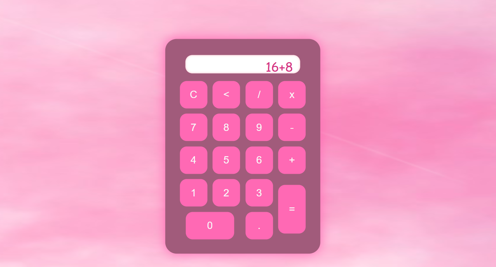

# ⋆.˚✮🧮✮˚.⋆ Calculadora ✨

Este é um projeto de calculadora simples e fofa, feita com HTML, CSS e JavaScript, perfeita para praticar conceitos básicos de desenvolvimento web! 💖

## ⋆⭒˚.⋆🪐 ⋆⭒˚ Funcionalidades

- Adição ➕ 
- Subtração ➖ 
- Multiplicação ✖️  
- Divisão ➗ 
- Limpar e apagar última entrada  
- Interface visual com tema rosa e efeitos de nuvem ☁️✨  

## ‧₊˚🖇️✩ ₊˚🎧⊹♡ Tecnologias utilizadas

- HTML5  
- CSS3  
- JavaScript  

## ༄˖°.🍂.ೃ࿔*:･ Inspiração visual

Inspirada em estéticas kawaii e vibes mágicas, com fundo roxinho e botões cor-de-rosa 🌸

## ˙✧˖°📷 ༘ ⋆｡˚ Screenshot

## ‧₊˚ ☁️⋅♡𓂃 ࣪ ִֶָ☾. Como usar

1. Clone o repositório:
git clone https://github.com/maryavila/calculadora

2. Abra o arquivo `index.html` em um navegador.

## ⭒₊ ⊹🌕₊ ⊹⭒ Aprendizados

Esse projeto ajudou a praticar:
- Manipulação de DOM com JavaScript
- Organização de layout com CSS
- Criação de um projeto completo do zero 💪

## ──★ ˙🍓 ̟!! Licença

Este projeto está sob a licença MIT. Sinta-se à vontade para usar e modificar! 😊

---

Feito com 💖 por Mariany Ávila
